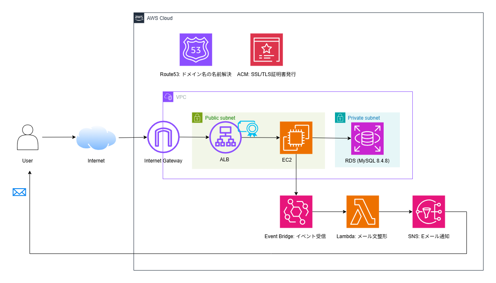
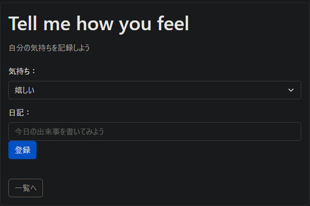
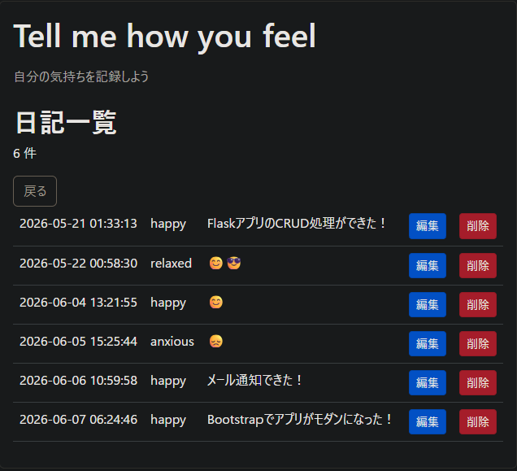

## 概要
- 自分の気持ちと日記を記録できるアプリ

## 特徴
- 独自ドメイン名で公開（Route53）
- HTTPS対応（ACM）
- 日記登録時にメール通知（EventBridge＋Lambda＋SNS）

## 構成図
- 全体

## アプリ

## 技術スタック
- フロントエンド
  - HTML
  - Bootstrap 5

- バックエンド
  - Flask

- データベース
  - MySQL 8.4

- インフラ（AWS）
  - Amazon EC2
  - Amazon RDS for MySQL
  - Amazon Route 53
  - AWS Certificate Manager (ACM)
  - Amazon EventBridge
  - AWS Lambda
  - Amazon SNS

- OS
  - Amazon Linux 2023

- 構成管理
  - Ansible
